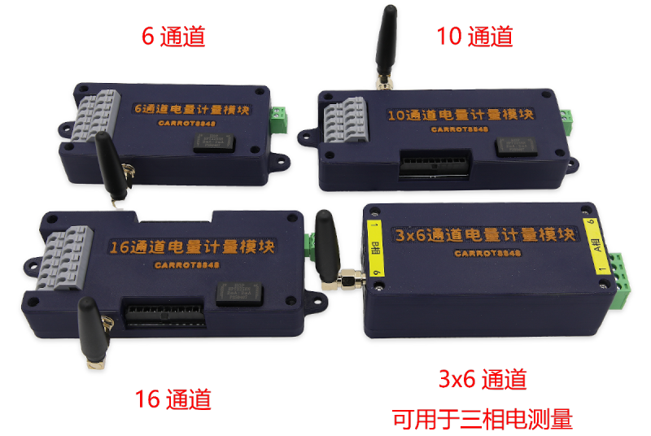
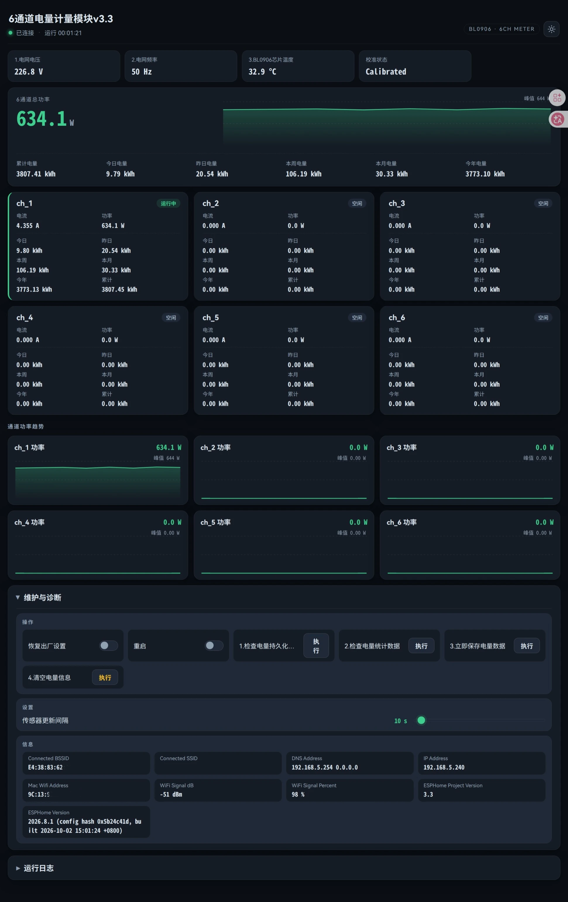

# ESPHome 参考配置

本仓库提供电量计量模块等产品的 ESPHome 参考 YAML 配置。驱动组件本身（BL0906/BL0910 外部组件）在独立仓库：[bl0906_carrot8848](https://github.com/carrot8848/bl0906_carrot8848)，组件安装与配置项说明见其 README。

  

## 产品与配置

| 产品 | 芯片 | 外形尺寸 | 参考配置 | 购买 |
|------|------|---------|---------|------|
| 6 通道电量计量模块 | BL0906 | 101×50×23 mm | [6-ch-monitor-3.0](6-ch-monitor-3.0/) | [淘宝购买](https://item.taobao.com/item.htm?id=793797215362) |
| 10 通道电量计量模块 | BL0910 | 123×50×23 mm | [10-ch-monitor-3.0](10-ch-monitor-3.0/) | [淘宝购买](https://item.taobao.com/item.htm?id=999413514343) |
| 16 通道电量计量模块 | BL0906 + BL0910 | 120×55×23 mm | 待补充 | [淘宝购买](https://item.taobao.com/item.htm?id=999413514343) |
| 3×6 通道电量计量模块 | BL0906 ×3 | 105×50×36 mm | 待补充 | [淘宝购买](https://item.taobao.com/item.htm?id=971222114086) |

表中尺寸均不包含凸起部分。

### 模块供电

电源电压：85-305V
电网频率：50-60Hz

### 计量精度

每通道通过专用设备按0.1%误差校准，算上互感器线性度误差，整体误差在1%以内。

### 量程范围

2000:1互感器每通道最大125A电流，如需测量更大电流，需更换大变比互感器。

## 界面预览

6 通道模块 Web 界面：

  

## 使用方法

仓库中的yaml文件直接使用即可，可根据实际情况修改部分配置。

## 安装注意事项
1. 根据图片中的火线零线位置给模块供电，推荐0.5-1平方线，此处同时采集电网电压。
2. 互感器上标有电流方向，如果套反了功率为负。
3. 标配互感器最大可测量20A电流，高于此电流需升级大号互感器。最大可穿过4平方常用单股硬线。空气开关下方如果有并线的情况标配互感器是穿不过去的，需要升级大号互感器。
4. 电流互感器严禁开路！如果开路，1次侧如果有电流流过，2次侧开路两端会产生高压！
5. 开口互感器精度比穿心式低，体积较大，小电箱慎重选择。
6. 由于涉电维修安装，务必确保操作人员持有电工类作业资质并采取必要的断电、绝缘防护措施。

## 其他配置

| 目录 | 说明 |
|------|------|
| [ESP32-eth](ESP32-eth/) | ESP32 以太网 |
| [PZEM_adapter](PZEM_adapter/) | PZEM 电能表 |
| [Smart-Plug-01](Smart-Plug-01/) / [Smart-Plug-02](Smart-Plug-02/) | 智能插座 |
| [UPS-fan-controller](UPS-fan-controller/) | UPS 风扇控制 |

## 许可证

本仓库的 YAML 配置与文档以 [PolyForm Noncommercial 1.0.0](LICENSE) 协议发布：

- **允许**：个人使用、学习、研究，以及在自己的非商业 ESPHome 项目中使用
- **禁止**：任何商业用途，包括将配置集成到对外销售的产品中；商业授权请联系作者
- 驱动组件（预编译库）另有许可，见 [bl0906_carrot8848](https://github.com/carrot8848/bl0906_carrot8848) 仓库说明

以上为中文摘要，具体条款以 [LICENSE](LICENSE)（英文原文）为准。

固件基于 [ESPHome](https://github.com/esphome/esphome) 构建，其 C++ 运行时以 GPLv3 发布，源码可从 ESPHome 官方仓库获取。

Copyright (c) 2026 carrot8848. All rights reserved.
